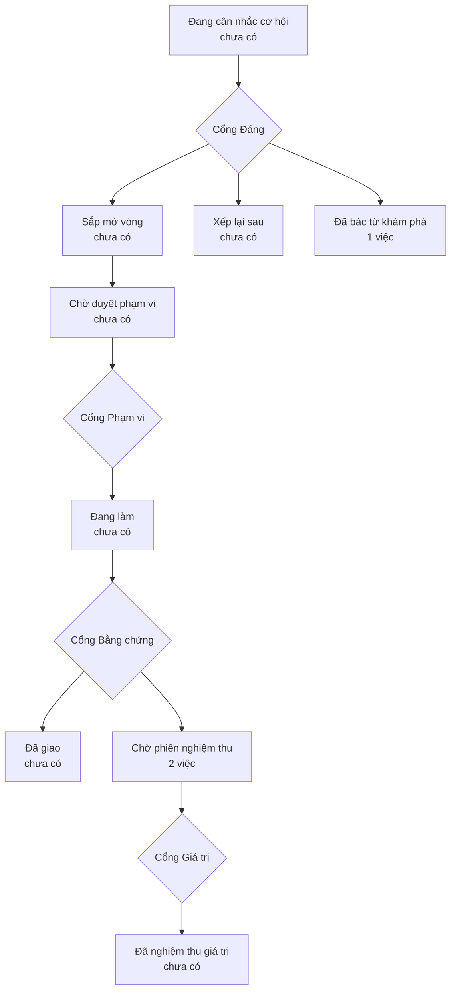

# Bản đồ sản phẩm

> Bản đồ vẽ lại từ hồ sơ của xưởng mỗi lần một người ký một cổng — đừng sửa tay.
> (đọc từ thư mục `_acceptance/` và `.out-of-scope/`)

> **Bốn cổng người** — mỗi cổng là một câu hỏi chỉ người trả lời được:
> **Cổng Đáng** việc này có đáng làm không · **Cổng Phạm vi** bộ tiêu chí
> đã đủ và đúng chưa · **Cổng Bằng chứng** đã làm đúng thứ đã hứa chưa ·
> **Cổng Giá trị** thứ đã giao có ăn thua không.

## Đã giao — chờ phiên nghiệm thu

- Lựa chọn của người đi theo người, không nằm lại trên máy (`cau-hinh-di-theo-nguoi`)
- Bài học bám đúng thứ bé đang học ở trường — không phải kể lại bối cảnh mỗi lần (`hieu-be-dang-hoc-gi`)

## Đã bác từ khám phá

- Giọng đọc phải nói được thứ tiếng của khóa học (`giong-doc-dung-tieng`)
